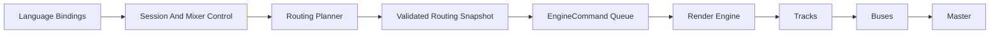
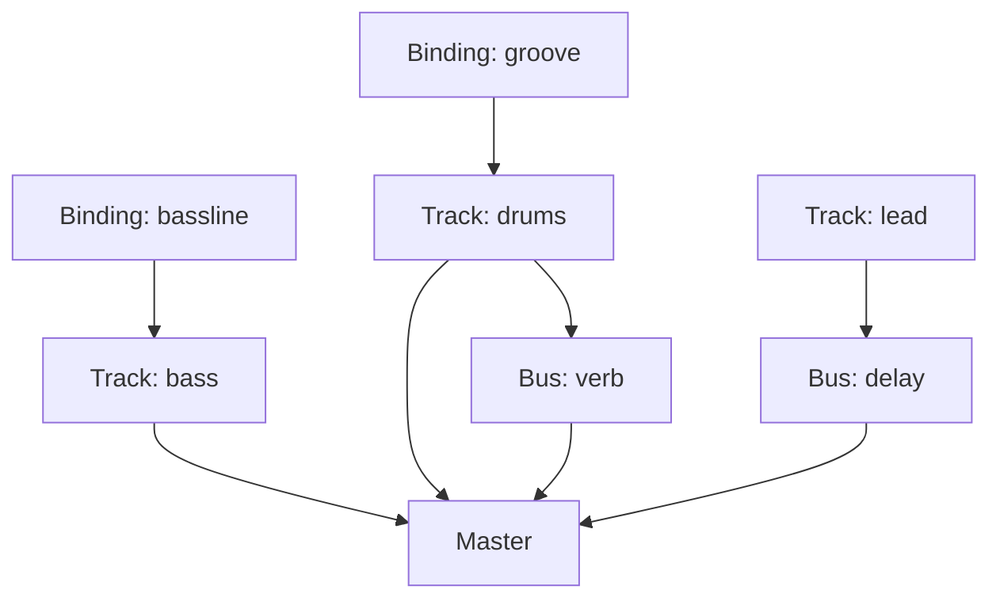

# Routing And Mixer Architecture Design

- Status: Proposed
- Date: 2026-03-23

## Goal

Treat routing as a first-class architectural layer, not as an isolated "shared
reverb" feature. Orpheus needs a coherent model for tracks, buses, threading,
and future external destinations without turning live coding into graph
programming theater.

This design supersedes the narrower framing in
`docs/plans/effect_routing.md`. Shared effects are one use case. The real
problem is the lack of an explicit mixer and routing spine.

## Design Principles

1. DX first. Orpheus must feel like a live-coded instrument with a mixer spine,
   not Ableton Session View in terminal drag.
2. Internal graph, external mixer. The engine may be graph-native internally,
   but the public surface should be explicit tracks, buses, and selectors.
3. Stable identity beats incidental names. Track identity must not collapse into
   whatever binding names happen to exist this second.
4. Immutable render state. The audio thread should consume a frozen routing
   snapshot for the whole render block.
5. One audible path. A performer should be able to answer "where is this sound
   coming from?" quickly.
6. No second ontology for orbits. Grouping is a selector/view layer over tracks,
   not a rival runtime object species.

## Why Not Just Add Effect Sends

The current effect-routing spec solves a real problem, but too locally. Shared
reverb and delay require:

- stable track identity
- bus topology
- safe routing mutation
- render-thread-safe adoption of changes

If Orpheus adds buses without solving those, it gets a feature-shaped hole:
better effects, still-haunted mixer semantics.

Chord-quality sugar does not have the same urgency. The existing language can
already express most chord vocabulary honestly through bindings:

```orpheus
maj7 = 0 4 7 11
m7 = 0 3 7 10
pad = chord(c4, m7) |> invert(1)
```

Routing, by contrast, cannot be faked in user space. It needs engine-level
identity and topology.

## Core Model

### Runtime nouns

- `Binding`: musical definition in the language layer such as `groove`,
  `bassline`, or `pad`.
- `Track`: stable mixer/runtime object with identity, assignment, level, pan,
  mute/solo state, insert chain, and sends.
- `Bus`: named mixer destination that can host shared effects and mix back into
  master.
- `Master`: final stereo sink in phase 1.
- `RoutingSnapshot`: immutable, validated render-side routing plan.

### Derived control nouns

- `Selector`: control-layer expression that resolves to one or more concrete
  track IDs before render.
- `Orbit`: sugar or a named selector over tracks. Not a separate DSP/runtime
  object in phase 1.

The important separation is:

- bindings define musical material
- tracks own runtime identity
- selectors/orbits operate on sets of tracks
- buses define shared signal flow

That keeps the language composable without tying mixer identity to ephemeral
code names.

## Surface Model

The performer-facing model should be "named mixer channels fed by code," not
"patch a user-programmable graph by hand."

Likely phase-1 operations:

- create a track
- bind a track to a binding/source
- create a bus
- route a track to master and/or sends
- set per-track level, pan, mute, solo
- inspect current routing state in the TUI and REPL

Representative command surface:

```text
:track new drums
:track bind drums groove
:track level drums 0.8

:bus new verb reverb(room=0.8)
:send drums verb 0.35
```

This keeps topology in the mixer control plane rather than encoding routing
directly into pattern expressions. Later, time-varying automation can be layered
on top of track parameters without making topology itself pattern-valued.

## Architecture Overview



The key split is:

- control world: mutable, validating, expressive
- render world: immutable, deterministic, low-latency

That same pattern already shows up elsewhere in systems we trust:
double-buffered render state, MVCC snapshots, command-buffer handoff, and
lock-free control snapshots. Different coats, same ghost.

## Threading Strategy

Current Orpheus already has the beginnings of this shape:

- `EngineHandle` as the control-side entry point
- `EngineCommand` as the queued handoff boundary
- `RenderEngine` and `EngineCore` as the render-side state
- `SharedTransport` as a snapshot publication mechanism

Routing should extend that pattern rather than inventing a new one.

### Proposed split

Control thread responsibilities:

- manage track and bus definitions
- resolve selectors into concrete track IDs
- validate topology
- compile bindings and assignments into a render-ready routing snapshot
- enqueue a routing-swap command

Render thread responsibilities:

- consume one immutable active routing snapshot for the entire render block
- optionally hold one pending snapshot
- adopt pending snapshots only at a safe commit point
- render tracks, then buses, then master without locking or allocation

### Swap semantics

Routing swaps should be committed at cycle boundaries in phase 1, matching the
current "pending pattern" model. That keeps the audible behavior legible and
avoids half-updated topology mid-phrase.

This implies a new command family conceptually like:

- `SwapRoutingSnapshot(snapshot)`

The render side should never observe partially-mutated routing state.

## Internal Graph Shape

The engine should use a validated DAG internally, but phase 1 should constrain
the public topology to:

```text
source binding -> track -> bus/master -> master
```

Allowed edges in phase 1:

- binding/source -> track
- track -> master
- track -> bus
- bus -> master

Explicitly forbidden in phase 1:

- bus -> bus
- bus -> track
- track -> track
- any cycle or feedback path

This gives the engine a graph core without exposing a full graph language to the
user. The surface stays mixer-like while the internals stay future-proof.

## Selectors And Orbits

Tracks are the runtime atoms. Orbits are not.

Selector algebra should compile to concrete track IDs in the control plane. For
phase 1, the minimal selector surface can just be single explicit track names.
Later phases can add:

- family selectors like `drums.*`
- indexed track groups like `drums[0]`
- named orbit/group aliases

What matters architecturally is that these remain derived control constructs.
The render thread should only see resolved track IDs and compiled routing state.

This preserves the composable algebra without growing a second runtime kingdom.

## UX Constraints

The biggest failure mode here is cognitive, not technical. Routing becomes a
disaster if:

- users cannot tell why a deleted binding still makes sound
- bindings, tracks, buses, and selectors feel like disconnected systems
- topology changes come from too many unrelated surfaces
- the internal graph leaks directly into performance syntax

To keep DX clean, phase 1 should enforce:

- every audible source belongs to one explicit track
- every track has an inspectable assignment and route
- unbound tracks go silent rather than retaining haunted state
- track identity survives binding redefinition
- routing state has one obvious source of truth in session/mixer control

This is the line between "live mixer with code-fed tracks" and "spreadsheet of
audio ghosts."

## Data Model Sketch



Render-side snapshot contents will likely include:

- track table with stable IDs
- per-track binding/source assignment
- per-track level/pan/mute/solo state
- track insert descriptors
- send descriptors from track to bus
- bus table and bus insert chains
- a topologically valid execution order

## Phase 1 Scope

Phase 1 should include:

- explicit tracks with stable IDs
- explicit master bus
- named effect buses
- track-to-bus sends
- one routing snapshot handoff path from control to render
- TUI/REPL inspection of routing state
- offline render compatibility with the same routing model

Phase 1 should not include:

- arbitrary user-authored graph syntax
- feedback loops
- bus-to-bus routing
- surround or multichannel output
- sidechain routing
- implicit one-track-per-binding semantics
- Ableton-specific scene/session metaphors

## Key Invariants

These are the invariants that deserve to be formalized and tested before the
feature grows teeth:

- routing topology is acyclic
- every route terminates at an allowed sink
- each render block observes exactly one active routing snapshot
- selector expressions are resolved before render
- track IDs are stable across binding edits
- deleting or renaming a binding cannot leave stale audible state behind
- routing swaps happen only at safe commit points
- render-side routing traversal performs no heap allocation or locking

## Future Expansion Paths

If this spine is correct, it unlocks later features without rewriting the world:

- shared reverb, delay, and parallel compression
- per-track metering and mixer panes in the TUI
- stem export by track or bus
- automation lanes for track parameters
- external MIDI tracks or external audio sends
- Ableton or DAW bridge integration at the boundary

That is the main reason to do the architecture first: routing becomes a platform
for later expressive features instead of a one-off effects patch.

## Recommendation

Adopt a graph-core, mixer-surface routing architecture:

- explicit tracks as stable runtime entities
- selectors/orbits as derived control views over tracks
- immutable validated routing snapshots
- render-thread adoption at cycle-safe commit points
- no public graph programming surface in phase 1

That gives Orpheus the right balance of capability and live-coding clarity:
internally horizontal, externally legible.
